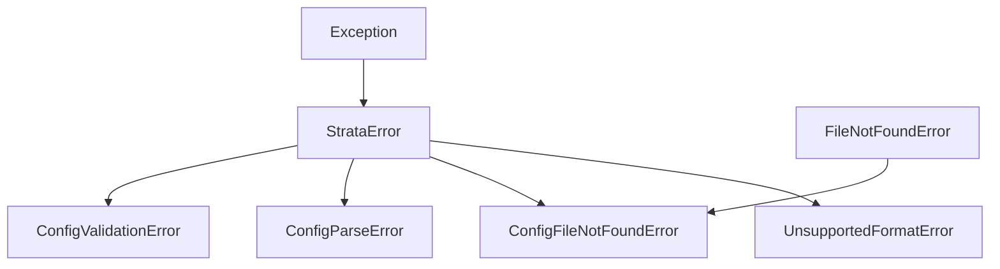

# Exceptions

**strata** uses a typed exception hierarchy rooted at `StrataError`.  All
exceptions can be caught with a single `except StrataError` or individually.

## Hierarchy

!!! tip "`ConfigFileNotFoundError` inherits from both `StrataError` and `FileNotFoundError`"

    This means you can catch it with either `except StrataError` or
    `except FileNotFoundError`, depending on your error-handling style.

## `StrataError`

::: strata.StrataError
    options:
      show_source: true

## `UnsupportedFormatError`

::: strata.UnsupportedFormatError
    options:
      show_source: true

## `ConfigFileNotFoundError`

::: strata.ConfigFileNotFoundError
    options:
      show_source: true

## `ConfigParseError`

::: strata.ConfigParseError
    options:
      show_source: true

## `ConfigValidationError`

::: strata.ConfigValidationError
    options:
      show_source: true

