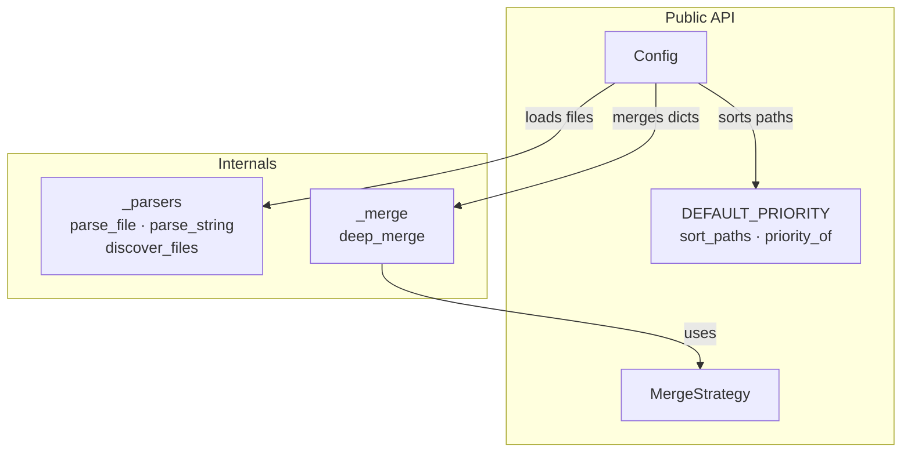

# API Reference

Complete reference for all public classes, functions, and constants exported
by **imbrex**.

## Public API

All public symbols are available from the top-level `imbrex` package:

```python
from imbrex import (
    Config,
    MergeStrategy,
    DEFAULT_PRIORITY,
    ImbrexError,
    ConfigFileNotFoundError,
    ConfigParseError,
    ConfigValidationError,
    UnsupportedFormatError,
)
```

## Modules

| Page | Description |
|---|---|
| [`Config`](config.md) | The core configuration container — loaders, merging, validation, dict-like access |
| [`MergeStrategy`](merge.md) | Merge strategy enum and the `deep_merge()` function |
| [`Priority`](priority.md) | `DEFAULT_PRIORITY` table, `sort_paths()`, `priority_of()` |
| [`Exceptions`](exceptions.md) | Typed exception hierarchy |

## Architecture


