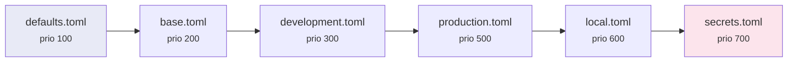

# Directory Loading & Priority

When loading configuration from a directory, **strata** automatically discovers
files, sorts them by a well-known priority table, and merges them so that
higher-priority files override lower ones.

## How it works

```python
from strata import Config

cfg = Config.from_dir("config/", extension="toml", env="production")
```

This performs three steps:

1. **Discover** — find all `.toml` files in `config/`.
2. **Sort** — order them by the built-in priority table.
3. **Filter** — exclude files whose tier is *above* the active environment.
4. **Merge** — deep-merge from lowest to highest priority (last wins).

## The priority table

Files are sorted by matching their **stem** (filename without extension)
against the priority table.  Higher numbers are loaded later and therefore
win on conflicts.

| Stem(s) | Priority | Role |
|---|---:|---|
| `defaults`, `default` | 100 | Sensible factory defaults |
| `base`, `common`, `shared` | 200 | Shared across all environments |
| `development`, `dev` | 300 | Local development overrides |
| `test`, `testing`, `staging` | 400 | CI / staging overrides |
| `production`, `prod` | 500 | Production overrides |
| `local` | 600 | Machine-specific (git-ignored) |
| `secrets`, `secret` | 700 | Sensitive values (git-ignored) |

Files whose stem is **not** in the table receive priority **0** and are loaded
first — they can be overridden by everything else.

### Visual flow



## Environment filtering

When you pass `env="development"`, strata computes the priority ceiling for
that environment (300) and **excludes** every file with a higher priority.
This prevents production values from leaking into development:

```python
# Only loads: defaults (100), base (200), development (300)
# Excludes:  production (500), local (600), secrets (700)
cfg = Config.from_dir("config/", extension="toml", env="development")
```

```python
# Loads everything up to and including production (500)
# Excludes: local (600), secrets (700)
cfg = Config.from_dir("config/", extension="toml", env="production")
```

### Automatic environment detection

If you don't pass `env=`, strata checks these environment variables in order:

1. `APP_ENV`
2. `ENV`
3. `ENVIRONMENT`

If none are set, **no filtering** is applied and all files are loaded.

### Disabling the ceiling

Pass `max_env_priority=False` to `sort_paths()` (or load without `env=`)
to include every file regardless of tier.

## Explicit stem ordering

Bypass the priority table entirely by specifying an explicit load order:

```python
cfg = Config.from_dir(
    "config/",
    extension="toml",
    order=["defaults", "production"],  # only these, in this order
)
```

- Only files whose stem matches are loaded.
- Missing stems are silently skipped.
- The automatic priority sort is completely bypassed.

## Custom priority table

Extend or override the built-in table:

```python
cfg = Config.from_dir(
    "config/",
    extension="toml",
    env="canary",
    priority_table={
        "canary": 450,      # new tier between staging and production
        "production": 9999,  # override built-in priority
    },
)
```

Custom entries are **merged on top** of `DEFAULT_PRIORITY`, so you only need
to specify the entries you want to add or change.

## Recursive discovery

Descend into sub-directories:

```python
cfg = Config.from_dir("config/", extension="toml", recursive=True)
```

## Debugging priority

Use `priority_of()` to inspect the numeric priority for any stem:

```python
from strata import DEFAULT_PRIORITY
from strata._priority import priority_of

print(priority_of("defaults"))      # 100
print(priority_of("production"))    # 500
print(priority_of("unknown_file"))  # 0
print(priority_of("myenv", env="myenv"))  # 350  (unknown env fallback)
```

## Supported formats

| Format | Extensions |
|---|---|
| TOML | `.toml` |
| YAML | `.yaml`, `.yml` |
| JSON | `.json` |

Specify the format via the `extension` parameter:

```python
Config.from_dir("config/", extension="yaml")
Config.from_dir("config/", extension="json")
```

